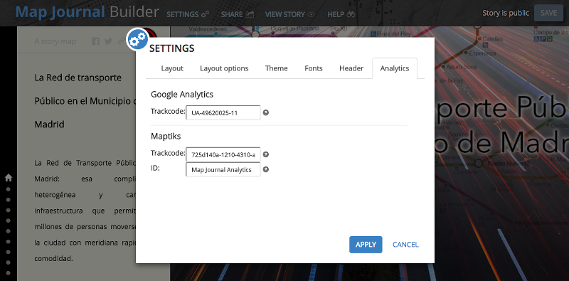

# Demo

**Cómo añadir una opción de configuración**

Vamos a ver las modificaciones para añadir a una pestaña del popup de "Settings" en el [Story Map Journal Analytics](https://github.com/hhkaos/storymap-journal-analytics).

Pasos:

* Creamos la vista: [ViewAnalytics.html](https://github.com/hhkaos/storymap-journal-analytics/blob/master/src/app/storymaps/tpl/builder/settings/ViewAnalytics.html), [ViewAnalytics.js](https://github.com/hhkaos/storymap-journal-analytics/blob/master/src/app/storymaps/tpl/builder/settings/ViewAnalytics.js) &  [ViewAnalytics.css](https://github.com/hhkaos/storymap-journal-analytics/blob/master/src/app/storymaps/tpl/builder/settings/ViewAnalytics.css)
* [Definimos los métodos para guardar y recuperar los datos](https://github.com/hhkaos/storymap-journal-analytics/blob/master/src/app/storymaps/tpl/core/WebApplicationData.js#L385)
* [Definimos](https://github.com/hhkaos/storymap-journal-analytics/blob/master/src/app/storymaps/tpl/core/Analytics.js) y [cargamos](https://github.com/hhkaos/storymap-journal-analytics/blob/master/src/app/storymaps/tpl/core/MainView.js#L2)  el nuevo módulo.
* Cargamos la nueva vista en el BuilderView
    * [Cargar dependencias](https://github.com/hhkaos/storymap-journal-analytics/commit/761fc7f234b3afcf8a8896700f6524d14a99fee1#diff-0e51faaaf34cfb6555ca2bf783f7c7faL18)
    * [Cargar valores almacenados](https://github.com/hhkaos/storymap-journal-analytics/blob/761fc7f234b3afcf8a8896700f6524d14a99fee1/src/app/storymaps/tpl/builder/BuilderView.js#L417)
    * [Guardar valores](https://github.com/hhkaos/storymap-journal-analytics/blob/761fc7f234b3afcf8a8896700f6524d14a99fee1/src/app/storymaps/tpl/builder/BuilderView.js#L444)
* [Eliminamos el código estático](https://github.com/hhkaos/storymap-journal-analytics/commit/761fc7f234b3afcf8a8896700f6524d14a99fee1#diff-e249faefed5757034596c5096d33dab6L353)
* [Crear el código como dinámico](https://github.com/hhkaos/storymap-journal-analytics/blob/master/src/app/custom-scripts.js#L15)
