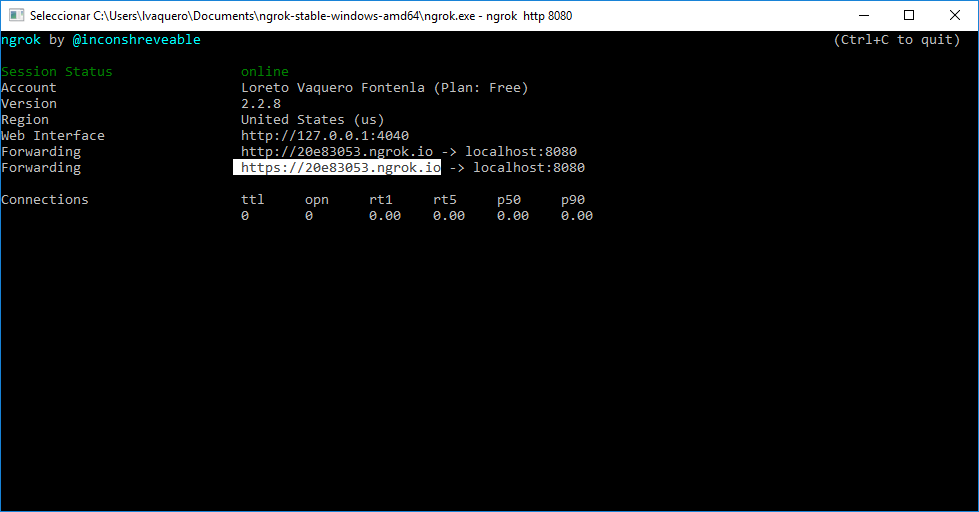
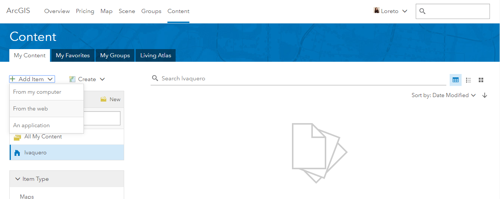
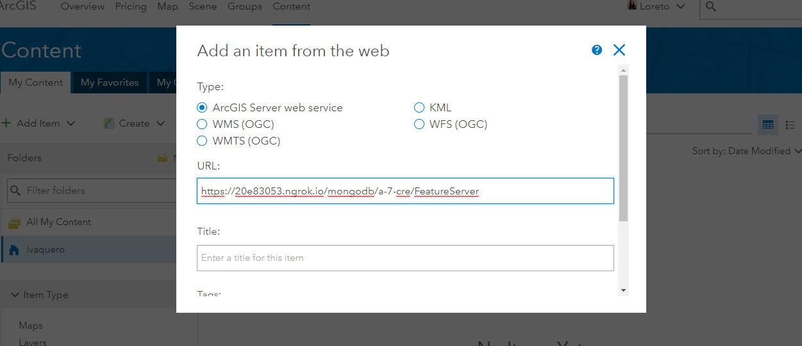

# Example Guide

This is a use case for the koop-provider-mongodb.
The [data](data/cameras.csv) source is a list of Spanish road traffic cameras.

## Check koop-provider-mongodb

1. **Create Node.js project**:
 1. Create a directory:
 ```sh
 $ mkdir my-project
 ```
 2. To execute in the project:
 ```sh
 $ npm init –y
 ```
*npm init -y: generate the package.json file with default options (without asking any questions)*


2. **Mongodb**:
 1. Run mongodb
  ```sh
  $ mongod
  ```
  1. Import the data to MongoDB server.

     To execute in the project:
  ```sh
  $ mongoimport.exe -d koop -c cameras --type csv --file cameras.csv --headerline
  ```
    - `d`: Specifies the name of the database on which to run the   mongoimport
    - `c`: Specifies the collection to import
    - `type`: Specifies the file type to import. The default format is   JSON, but in this case, we're going to to import csv files.
    - `field`: field name.
    - `heardline`:uses the first line as field names

  The project is in the local computer, that is, it is in "localhost".
  The port that is listening is the default port of the MongoDB installation.

  We can use [**Robo 3T**](https://robomongo.org/download) too.
  Previously known as RoboMongo, Robo 3T is a tool that we allow us to visually manage our MongoDB databases.

  This is a visual manager of non-relational databases with MongoDB, in which we will be able to manipulate all our collections and documents.

4. **Check koop-provider-mongodb**
 1. Create `server.js` and add content
 ```sh
 $ touch server.js
 ```

    ```js
    const config = require('config')
    const Koop = require('koop');

    const koop = new Koop(config);
    const FeatureServer = require('koop-output-geoservices')
    const Provider = require('koop-provider-mongodb')

    koop.register(Provider);
    koop.register(FeatureServer);

    // In Local Development, be aware that port has to be greater than 1024 ( Unpriviledge port)
    koop.server.listen(8080);
    ```
  1. Create configuration:

     ```sh
    $ mkdir config
    $ cd config
    $ touch default.json
    ```
  1. Fill default.json with proper data

     ```js
     {
       "mongodb": {
         "url": "mongodb://localhost:27017",
         "databasename": "koop",
         "collectionname": "cameras",
         "field_id":"carretera",
         "latitude": "lat",
         "longitude": "lng",
         "projectObj":{
           "lng": 1,
           "lat": 1,
           "PK": 1,
           "alias": 1,
           "carretera": 1,
           "codEle": 1,
           "estado": 1,
           "sentido": 1
         }
       }
     }
 ```
  1. Install dependencies:

      ```sh
      $ npm i koop@3.9.4
      $ npm i koop-provider-mongodb
      ```

  1. Start

      ```sh
      node server.js
      ```

1. In your browser:
```sh
$ curl http://localhost:8080/mongodb/AP-9/FeatureServer
```

1. Expose a local web server to the internet:
 1.  ngrok console UI
 ```sh
 $ ngrok http 8080
 ```

 1. Select https://
 

1. In ArcGIS Online:
   1. Log in
   1. Content > Add Item > From The Web

    

   1. Select **ArcGIS Server web service** and introduce the **url** of the service.
   The **url** will be, the random url from ngrok plus service name from koop provider.
   Add title and tags

    

  1. Check: Open in Map Viewer
