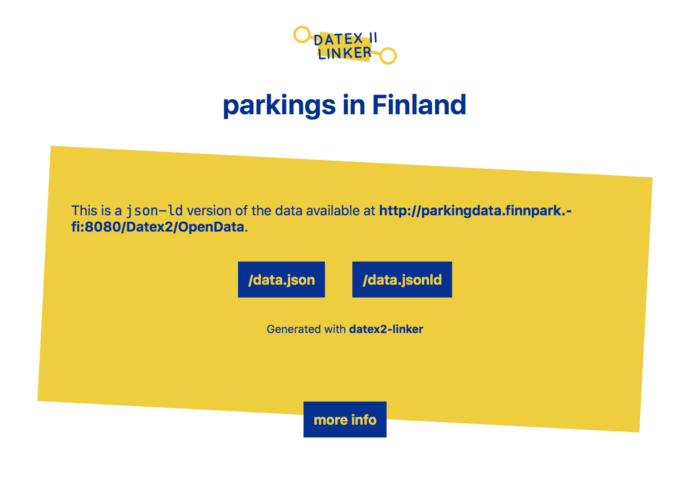

<h1 align="center"><a href="https://github.com/osoc16/datex2-linker"></a></h1>

> creating an accessible and standard JSON-LD page from an existing datex2 feed

[](https://travis-ci.org/osoc16/datex2-linker)
[](https://www.npmjs.com/package/datex2-linker)

# Getting started

## Installing

Make sure you have [node](https://nodejs.org/en/download/) and npm installed.

Install `datex2-linker`

```sh
$ npm install -g datex2-linker
```

## Running

To run it with a provided data source, you can use the `datex2-linker` program.

```sh
$ datex2-linker --source "http://www.verkeerscentrum.be/uitwisseling/datex2full" --base "http://localhost:8000/" --port 8000
```

Then you should be able to find a data source in [`json-ld`](http://json-ld.org) at `/data.jsonld` and `/data.json`. At `/` there's some information about datex2, and other relevant links. The index will look like this:





If there are issues with combining this and your existing (valid) datex2, you should either open an issue or send a message on [gitter](https://gitter.im/oSoc16).


# Features

- [x] parse xml to json
- [x] give each id an unique URI
- [x] serve json and ld+json
- [x] make that URI accessible on the web
- [x] an easy cli interface
- [x] tested with a range of datafeeds
- [x] published on npm

# FAQ

> Who made this?

This is made by [Haroen Viaene](https://haroen.me) for iMinds (Data Science Lab) in the cadre of [open Summer of code 2016]().

> Who is this for?

Two kinds of people. First of all this is for data publishers that want to make their existing `datex2` feeds into json-ld without too much hassle. Secondly this is for developers dealing with a certain `datex2` feeds, but want to access them more easily.

> Can I use this programmatically instead of serving it via http?

Yes, you can. That's what the [`datex2-linker-api`](https://github.com/osoc16/datex2-linker-api) module on npm is for and is also used in this project.

> What does this do exactly?

It converts the xml into json, adds a `@context` and adds `@id`s. Then it serves it as `application/json` and `application/ld+json` as well as a short intro into the used technologies.

> Will this module cache?

No, you can use `nginx` or similar to cache the returned data based on your own preference. There's a good [guide](https://www.nginx.com/blog/nginx-caching-guide/) on how to do that written by `nginx` developers.

> Will this module allow `https`?

No. You have to use a reverse proxy like you can do with `nginx` for example. Article on [nginx.com](https://www.nginx.com/resources/admin-guide/reverse-proxy/) and by [DigitalOcean](https://www.digitalocean.com/community/tutorials/how-to-configure-nginx-with-ssl-as-a-reverse-proxy-for-jenkins).

> The context does not contain a particular term

The `datex2` terms were automatically generated from the `datex2` `xsl`, but it's possible that something went wrong with the conversion. To add a term you can open an issue on [OpenTransport/linked-datex2](https://github.com/OpenTransport/linked-datex2).

> Other questions or issues?

You can always open an issue, or tweet [@haroenv](https://twitter.com/haroenv/).

# License

© 2016 - Open Knowledge Belgium - iMinds — Haroen Viaene and [contributors](https://github.com/oSoc16/datex2-linker/graphs/contributors)

Licensed under the Apache 2.0 license.
